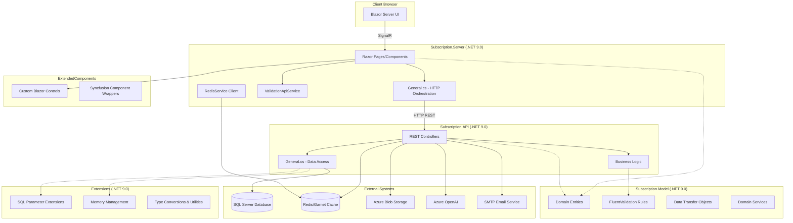
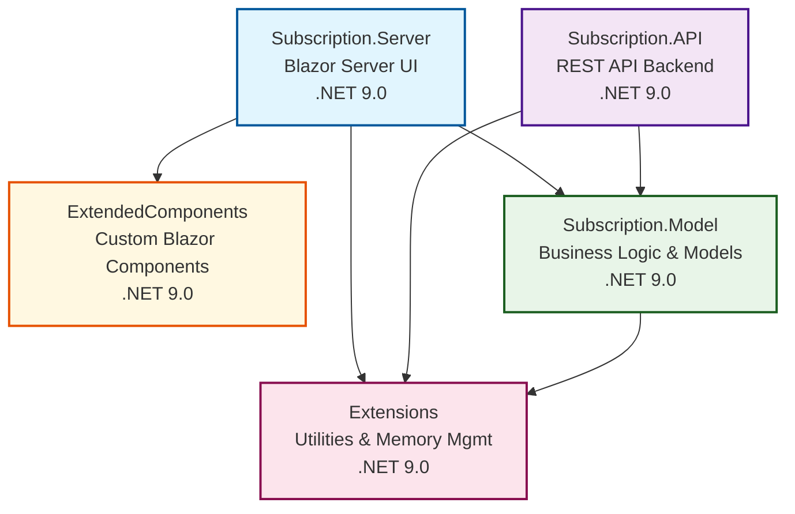
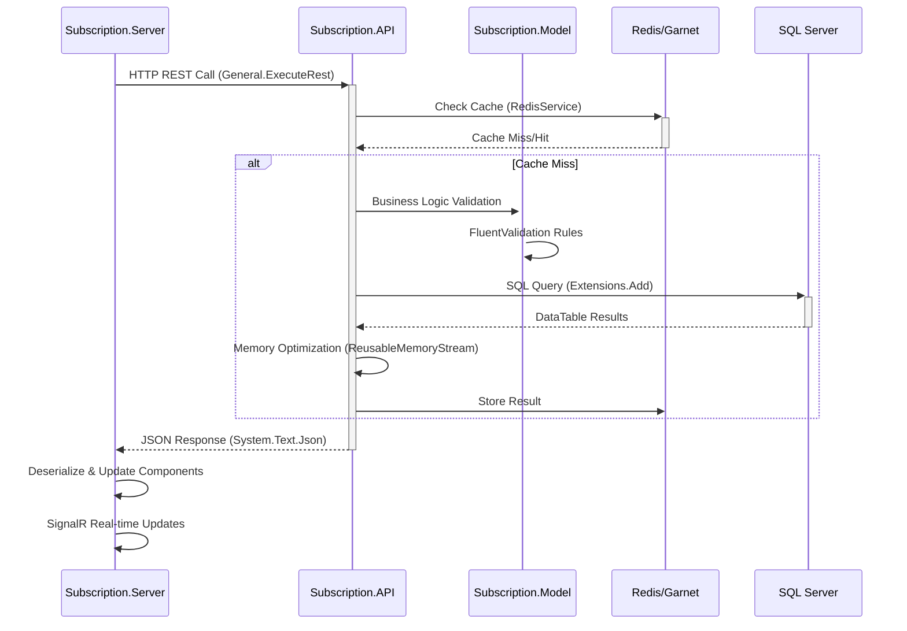
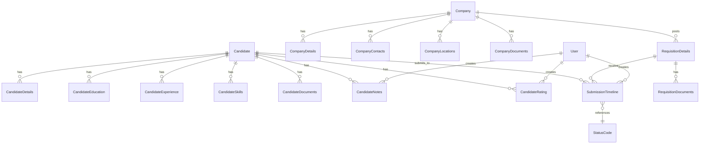
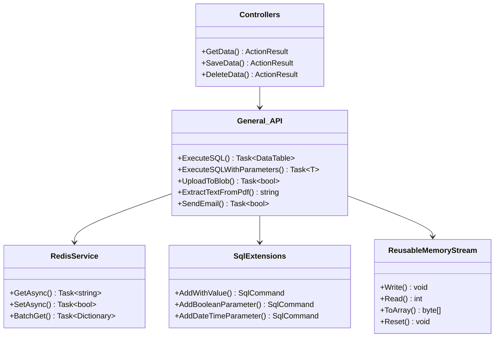
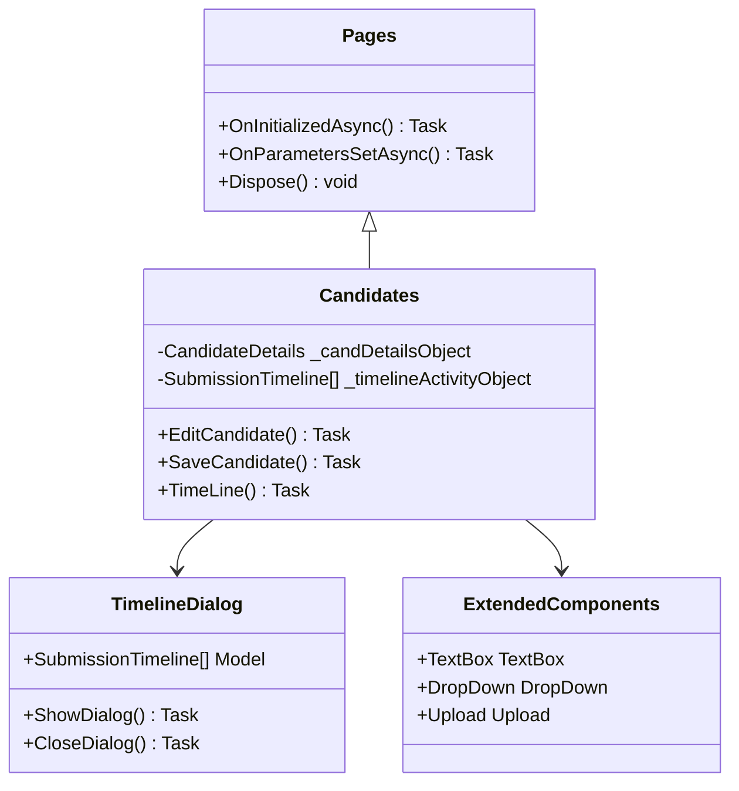

# .NET Enterprise Solution Architecture Analysis

**Generated:** 2025-07-28  
**Solution:** Subscription Management System  
**Projects Analyzed:** 5 Main Projects  

## Executive Summary

This document provides a comprehensive architectural analysis of the .NET enterprise subscription management system, including project dependencies, class relationships, and architectural patterns.

## Table of Contents

1. [Project Structure Overview](#project-structure-overview)
2. [Project Dependencies Analysis](#project-dependencies-analysis)
3. [Class Categories & Architectural Roles](#class-categories--architectural-roles)
4. [Key Architectural Patterns](#key-architectural-patterns)
5. [Visual Architecture Diagrams](#visual-architecture-diagrams)
6. [Detailed Class Relationships](#detailed-class-relationships)
7. [Enterprise Architecture Characteristics](#enterprise-architecture-characteristics)
8. [Performance Optimizations](#performance-optimizations)
9. [Security & Configuration](#security--configuration)
10. [Recommendations](#recommendations)

## Project Structure Overview

The solution consists of 5 main projects built on .NET 9.0:

### 1. **Subscription.Server** - Blazor Server UI Layer
- **Framework:** .NET 9.0 (Microsoft.NET.Sdk.Web)
- **Purpose:** Main user interface using Blazor Server with SignalR
- **Key Dependencies:** ExtendedComponents, Extensions, Subscription.Model
- **Technologies:** Syncfusion Blazor 30.1.41, Blazored.LocalStorage, System.Text.Json

### 2. **Subscription.API** - REST API Backend
- **Framework:** .NET 9.0 (Microsoft.NET.Sdk.Web)
- **Purpose:** RESTful API backend for data operations
- **Key Dependencies:** Extensions, Subscription.Model
- **Technologies:** Swashbuckle (OpenAPI), Microsoft.Data.SqlClient, System.Text.Json

### 3. **Subscription.Model** - Business Logic & Models
- **Framework:** .NET 9.0 (Microsoft.NET.Sdk)
- **Purpose:** Domain models, validation, and business logic
- **Key Dependencies:** Extensions
- **Technologies:** FluentValidation, Azure.AI.OpenAI, StackExchange.Redis, Serilog

### 4. **ExtendedComponents** - Custom Blazor Components
- **Framework:** .NET 9.0 (Microsoft.NET.Sdk.Razor)
- **Purpose:** Reusable custom Blazor components
- **Key Dependencies:** None (Syncfusion packages only)
- **Technologies:** Syncfusion Blazor Components

### 5. **Extensions** - Utility Foundation
- **Framework:** .NET 9.0 (Microsoft.NET.Sdk)
- **Purpose:** Extension methods, utilities, and memory management
- **Key Dependencies:** None
- **Technologies:** Microsoft.IO.RecyclableMemoryStream, System.Text.Json

## Project Dependencies Analysis

### Dependency Flow (Top-Down):
```
Subscription.Server (UI Layer)
├── ExtendedComponents (Custom UI Components)
├── Extensions (Utilities & Memory Management)
└── Subscription.Model (Business Logic & Models)
    └── Extensions (Base Utilities)

Subscription.API (Service Layer)  
├── Extensions (Utilities & Memory Management)
└── Subscription.Model (Business Logic & Models)
    └── Extensions (Base Utilities)

ExtendedComponents (Isolated UI Components)
└── [No project dependencies - only NuGet packages]

Extensions (Foundation Layer)
└── [No project dependencies - base utilities]
```

### Cross-Project Communication:
- **UI → API:** HTTP REST calls via `General.ExecuteRest<T>()`
- **API → Database:** SQL Server via parameterized queries
- **Caching:** Redis/Garnet distributed cache
- **File Storage:** Azure Blob Storage integration
- **AI Integration:** Azure OpenAI for document processing

## Class Categories & Architectural Roles

### A. Presentation Layer (Subscription.Server)

#### Main Pages:
- `Candidates.razor.cs` - Candidate management interface
- `Companies.razor.cs` - Company management interface  
- `Requisitions.razor.cs` - Job requisition management
- `Dash.razor.cs` - Dashboard with analytics
- `Login.razor.cs` - Authentication interface

#### Dialog Components:
Located in `Components/Pages/Controls/[Entity]/` folders:
- **Candidate Dialogs:** EditCandidateDialog, AddDocumentDialog, EditSkillDialog, etc.
- **Company Dialogs:** EditCompany, EditLocation, EditContact, etc.
- **Requisition Dialogs:** EditRequisition, AdvancedRequisitionSearch, etc.
- **Timeline Dialog:** TimelineDialog (newly implemented)

#### Infrastructure Components:
- `General.cs` - HTTP client orchestration and utility methods
- `ValidationApiService.cs` - Server-side validation API calls
- `Start.cs` - Application startup configuration
- `MasterDataCacheService.cs` - Cache management

### B. API Service Layer (Subscription.API)

#### Controllers with Specialized Organization:
Each major controller is split into focused files:

**CandidateController Structure:**
- `CandidateController.cs` - Main controller setup
- `CandidateController.Gets.cs` - Read operations
- `CandidateController.Saves.cs` - Write operations  
- `CandidateController.Deletes.cs` - Delete operations
- `CandidateController.Helpers.cs` - Utility methods

**Similar structure for:**
- `CompanyController.cs` (+ specialized files)
- `RequisitionController.cs` (+ specialized files)
- `AdminController.cs` - Administrative functions
- `DashboardController.cs` - Analytics and reporting
- `LoginController.cs` - Authentication

#### Infrastructure:
- `General.cs` - Data access layer with SQL operations
- `PasswordHasher.cs` - Security utilities
- `Start.cs` - API startup configuration

### C. Business Logic Layer (Subscription.Model)

#### Core Entities:
- `Candidate.cs` - Candidate master data
- `Company.cs` - Company master data
- `RequisitionDetails.cs` - Job requisition information
- `User.cs` - User management
- `CandidateDetails.cs` - Extended candidate information
- `CompanyDetails.cs` - Extended company information

#### Supporting Models:
- **Education:** `CandidateEducation.cs`
- **Experience:** `CandidateExperience.cs`
- **Skills:** `CandidateSkills.cs`
- **Documents:** `CandidateDocument.cs`, `CompanyDocuments.cs`
- **Notes:** `CandidateNotes.cs`
- **Locations:** `CompanyLocations.cs`, `CompanyContacts.cs`

#### Search Models:
- `CandidateSearch.cs` - Candidate search criteria
- `CompanySearch.cs` - Company search criteria
- `RequisitionSearch.cs` - Requisition search criteria

#### Return DTOs:
- `Return/ReturnGrid.cs` - Grid data responses
- `Return/ReturnDashboard.cs` - Dashboard data
- `Return/ReturnCandidateDetails.cs` - Candidate detail responses
- `Return/ReturnCompanyDetails.cs` - Company detail responses

#### Validation Layer:
FluentValidation classes in `Validators/` folder:
- `CandidateDetailsValidator.cs`
- `CompanyDetailsValidator.cs`
- `AdminListValidator.cs`
- `UserValidator.cs`
- And many more specific validators

#### Services:
- `RedisService.cs` - Distributed caching service
- `IValidationApiService.cs` - Validation service interface
- `SubmissionTimeline.cs` - Timeline data structure (newly added)

### D. Custom Component Library (ExtendedComponents)

#### Form Controls:
- `TextBox.razor.cs` - Enhanced text input
- `TextArea.razor.cs` - Multi-line text input
- `NumericTextBox.razor.cs` - Numeric input with validation
- `MaskedTextBox.razor.cs` - Formatted input (phone, SSN, etc.)

#### Complex Controls:
- `DropDown.razor.cs` - Enhanced dropdown with search
- `MultiSelect.razor.cs` - Multiple selection control
- `Upload.razor.cs` - File upload with progress

All components wrap Syncfusion Blazor controls with custom business logic.

### E. Utility Foundation (Extensions)

#### SQL Extensions (`Extensions.Add.cs`):
- `AddWithValue()` - Safe parameter addition
- `AddBooleanParameter()` - Boolean parameter handling
- `AddDateTimeParameter()` - DateTime parameter handling
- `AddIntParameter()` - Integer parameter handling

#### Data Conversions (`Extensions.To.cs`):
- `ToInt32()` - Safe string to integer conversion
- `ToDateTime()` - Safe string to DateTime conversion
- `ToMarkupString()` - HTML markup string creation
- `CultureDate()` - Culture-aware date formatting
- `FormatPhoneNumber()` - Phone number formatting
- `StripPhoneNumber()` - Phone number cleanup

#### Stream Management (`Extensions.Streams.cs`):
- `ToStreamByteArray()` - Stream to byte array conversion
- `ToBase64String()` - Base64 encoding utilities

#### Memory Management:
- `Memory/ReusableMemoryStream.cs` - Memory-efficient stream
- `Memory/MemoryStreamManager.cs` - Stream pooling
- `Memory/Base64Helper.cs` - Base64 operations

## Key Architectural Patterns

### A. Clean Architecture with Domain Separation
- **Presentation Layer** (Server) communicates only with Application Layer (API)
- **Application Layer** (API) orchestrates Business Logic (Model)
- **Business Logic** (Model) uses Infrastructure (Extensions)
- **No circular dependencies** - proper separation of concerns
- **Dependency Inversion** - interfaces abstract implementations

### B. CQRS-Inspired Controller Organization
- **Command/Query Separation** - Controllers split by operation type
- **Read Operations** - `.Gets.cs` files for data retrieval
- **Write Operations** - `.Saves.cs` files for data persistence
- **Delete Operations** - `.Deletes.cs` files for data removal
- **Helper Methods** - `.Helpers.cs` files for utility functions

### C. Blazor Server + Web API Hybrid Architecture
- **Server-side Blazor** for rich UI with component state management
- **SignalR integration** for real-time updates
- **Separate REST API** for data operations and external integrations
- **HTTP client orchestration** in Server layer calling API endpoints
- **Stateless API design** for horizontal scalability

### D. Advanced Memory Management Patterns
- **ObjectPool<T> implementations** for high-frequency objects
- **ReusableMemoryStream** for LOH (Large Object Heap) avoidance
- **Microsoft.IO.RecyclableMemoryStream** integration
- **Memory-efficient string operations** with Span<T>
- **Parallel deserialization** to reduce memory residence time

### E. Enterprise Caching Strategy
- **Multi-level caching** - Memory cache + distributed cache
- **Redis/Garnet distributed caching** with connection pooling
- **Environment-aware cache configuration** (localhost vs server)
- **Cache-aside pattern** with fallback mechanisms
- **SSL-enabled Redis connections** for security

### F. Validation Architecture
- **FluentValidation** for complex business rules
- **Server-side validation** with async API calls
- **Dynamic validation infrastructure** for uniqueness checking
- **ValidationApiService** for cross-entity validation
- **Client-side validation** integration with Blazor forms

## Visual Architecture Diagrams

### High-Level System Architecture



### Project Dependencies



### Data Flow Sequence



## Detailed Class Relationships

### Entity Relationship Mapping



### Service Layer Dependencies



### UI Component Hierarchy



## Enterprise Architecture Characteristics

### Technology Stack Integration

#### Core Technologies:
- **.NET 9.0** - Latest framework with C# 13 language features
- **Blazor Server** - Rich interactive UI with server-side rendering
- **ASP.NET Core Web API** - RESTful services with OpenAPI documentation
- **SignalR** - Real-time communication with optimized message sizes
- **Entity Framework** implications via SQL operations

#### UI Framework:
- **Syncfusion Blazor 30.1.41** - Enterprise-grade component library
- **Bootstrap integration** - Responsive design framework
- **Custom component library** - ExtendedComponents for business-specific controls

#### Data & Caching:
- **SQL Server** - Primary database with parameterized queries
- **Redis/Garnet** - Distributed caching with SSL connections
- **Azure Blob Storage** - File storage and document management
- **System.Text.Json** - High-performance JSON serialization

#### AI & External Services:
- **Azure OpenAI** - AI-powered document processing and text extraction
- **SMTP Email Services** - Automated email notifications
- **RESTful integrations** - External service connectivity

#### Development & Deployment:
- **IIS Integration** - App pool management with pre/post build events
- **Docker support** - Container deployment capabilities
- **Multiple environments** - Debug/Release/India/US configurations

### Performance Optimizations

#### Memory Management:
- **ObjectPool<T>** implementations for high-frequency object allocation
- **ReusableMemoryStream** to avoid Large Object Heap (LOH) pressure
- **Microsoft.IO.RecyclableMemoryStream** for efficient stream operations
- **Parallel deserialization** to reduce memory residence time
- **Span<T> usage** for memory-efficient string operations

#### Caching Strategy:
- **Multi-level caching** - In-memory + distributed Redis cache
- **Cache-aside pattern** with automatic fallback mechanisms
- **Environment-aware caching** - Different strategies for dev/prod
- **SSL-enabled Redis** with connection pooling
- **Batch cache operations** for reduced round trips

#### HTTP & Network:
- **Response compression** - Brotli and Gzip compression
- **HTTP connection pooling** - Reusable HttpClient instances
- **Async/await throughout** - Non-blocking I/O operations
- **SignalR optimization** - 10MB message limit configuration

#### Database Optimization:
- **Parameterized queries** - SQL injection prevention + plan reuse
- **Connection pooling** - Efficient database connection management
- **Stored procedure usage** - Optimized data access patterns
- **Parallel query execution** - Multiple concurrent database operations

### Security & Configuration

#### Authentication & Authorization:
- **Claims-based security** - Role and permission-based access control
- **JWT token management** - Secure authentication tokens
- **Password hashing** - Secure password storage with salt
- **Session management** - Secure session handling

#### Data Protection:
- **Input validation** - FluentValidation with business rules
- **XSS protection** - Safe HTML rendering with MarkupString
- **SQL injection prevention** - Parameterized queries throughout
- **File upload security** - Restricted file types and size limits

#### Configuration Management:
- **Environment-specific settings** - appsettings.json per environment
- **Secure connection strings** - Protected configuration sections
- **API host detection** - Automatic localhost vs server detection
- **SSL/TLS enforcement** - Secure communications throughout

#### Logging & Monitoring:
- **Serilog integration** - Structured logging with SQL Server sink
- **Error handling** - Comprehensive exception management
- **Performance monitoring** - Built-in metrics and diagnostics
- **Audit trails** - User activity tracking

## Recommendations

### Architecture Strengths
✅ **Excellent separation of concerns** with clean layer boundaries  
✅ **Memory-optimized patterns** throughout the application  
✅ **Modern .NET 9.0 features** with C# 13 language constructs  
✅ **Comprehensive caching strategy** with Redis distribution  
✅ **Enterprise-grade UI** with Syncfusion component integration  
✅ **Robust validation framework** with FluentValidation  
✅ **Scalable API design** with proper HTTP patterns  

### Areas for Enhancement

#### 1. Documentation & API Discovery
- **OpenAPI/Swagger** documentation completion for all endpoints
- **Architecture Decision Records (ADRs)** for major design decisions
- **Component library documentation** for ExtendedComponents usage

#### 2. Testing Strategy
- **Unit test coverage** for business logic in Subscription.Model
- **Integration tests** for API endpoints
- **Component testing** for Blazor components
- **Performance testing** for high-load scenarios

#### 3. DevOps & Deployment
- **CI/CD pipeline** optimization with automated testing
- **Container orchestration** with Kubernetes or Docker Swarm
- **Environment parity** between development and production
- **Health checks** and monitoring endpoints

#### 4. Security Enhancements
- **API rate limiting** to prevent abuse
- **Content Security Policy (CSP)** headers
- **OWASP security scanner** integration
- **Penetration testing** for security validation

#### 5. Performance Monitoring
- **Application Performance Monitoring (APM)** integration
- **Real-time metrics** dashboard
- **Database query performance** monitoring
- **Memory usage** tracking and alerting

### Future Architecture Considerations

#### Microservices Evolution
- **Domain-driven design** boundaries for service extraction
- **Event-driven architecture** with message queues
- **API Gateway** pattern for service orchestration
- **Service mesh** for inter-service communication

#### Cloud-Native Patterns
- **Azure Service Bus** for reliable messaging
- **Azure Functions** for serverless operations
- **Azure API Management** for API governance
- **Azure Monitor** for comprehensive observability

#### Modern Frontend Options
- **Blazor WebAssembly** for offline capabilities
- **Progressive Web App (PWA)** features
- **Micro-frontends** for team independence
- **Static site generation** for marketing pages

---

## File Inventory Analyzed

### Total Files Analyzed: 200+ files across 5 projects

**Subscription.Server** (80+ files):
- Razor components and code-behind files
- Layout and infrastructure components
- Business logic orchestration

**Subscription.API** (25+ files):
- RESTful controllers with CQRS organization
- Data access and business logic
- Authentication and security

**Subscription.Model** (60+ files):
- Domain entities and DTOs
- FluentValidation validators
- Service abstractions

**ExtendedComponents** (10+ files):
- Custom Blazor component library
- Syncfusion wrapper components

**Extensions** (15+ files):
- Utility extensions and helpers
- Memory management classes
- Base infrastructure

---

**Document Generated:** 2025-07-28  
**Analysis Scope:** Complete solution architecture  
**Next Review:** Recommend quarterly architecture reviews  