# .NET Solution Class Diagrams

**Generated:** 2025-07-28  
**Solution:** Subscription Management System  

## Table of Contents

1. [High-Level System Architecture](#high-level-system-architecture)
2. [Project Dependencies](#project-dependencies)
3. [Subscription.Server Class Diagram](#subscriptionserver-class-diagram)
4. [Subscription.API Class Diagram](#subscriptionapi-class-diagram)
5. [Subscription.Model Domain Structure](#subscriptionmodel-domain-structure)
6. [ExtendedComponents Library](#extendedcomponents-library)
7. [Extensions Utility Foundation](#extensions-utility-foundation)
8. [Entity Relationships](#entity-relationships)
9. [Service Dependencies](#service-dependencies)
10. [Data Flow Diagrams](#data-flow-diagrams)

## High-Level System Architecture

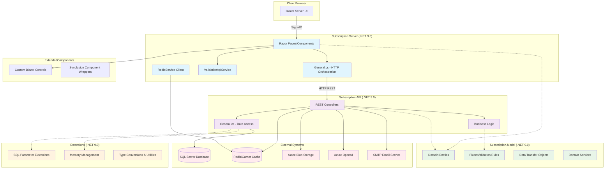

## Project Dependencies

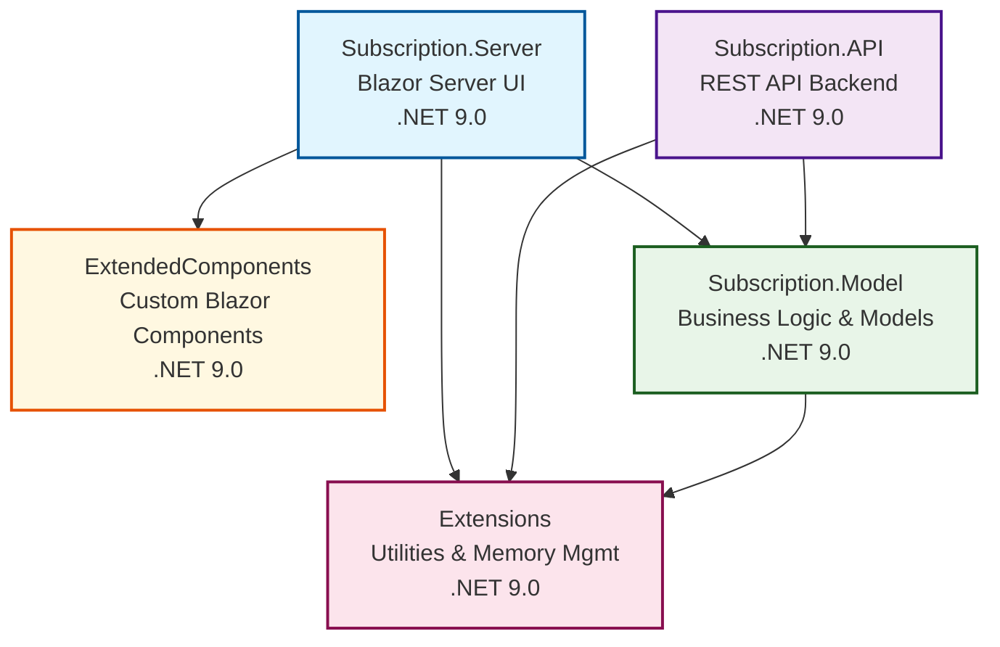

## Subscription.Server Class Diagram

```mermaid
classDiagram
    class Program {
        +Main(string[] args) void
        +ConfigureServices() void
        +ConfigureApp() void
    }
    
    class General {
        +ExecuteRest~T~(string endpoint, Dictionary parameters) Task~T~
        +ExecuteAndDeserialize~T~(string endpoint, Dictionary parameters) Task~T~
        +DeserializeObject~T~(string json) T
        +GetClaimsToken(LocalStorage localStorage, SessionStorage sessionStorage) Task~IEnumerable~Claim~~
        +DialogOptions(string message) DialogSettings
        +ExecuteMethod(SemaphoreSlim semaphore, Func task) Task
    }
    
    class ValidationApiService {
        -IConfiguration _configuration
        -HttpClient _httpClient
        +CheckAdminListTextExistsAsync(string text, int id, string entity, string code) Task~bool~
        +CheckCompanyEINExistsAsync(string ein, int companyId) Task~bool~
        +CheckTaxTermCodeExistsAsync(string code) Task~bool~
        +GetApiHost() string
    }
    
    class Start {
        +APIHost string
        +UploadsPath string
        +ConfigureApplication() void
    }
    
    class Candidates {
        -CandidateDetails _candDetailsObject
        -CandidateNotes[] _candidateNotesObject
        -SubmissionTimeline[] _timelineActivityObject
        -SubmissionTimeline[] _timelineObject
        -SemaphoreSlim _semaphoreMainPage
        +EditCandidate() Task
        +SaveCandidate() Task
        +DeleteNotes(int id) Task
        +TimeLine(int requisitionID) Task
        +Dispose() void
    }
    
    class Companies {
        -CompanyDetails _companyDetails
        -CompanyContacts[] _companyContacts
        -CandidateNotes[] _companyNotesObject
        -SemaphoreSlim _semaphoreMainPage
        +EditCompany(bool isAdd) Task
        +SaveCompany() Task
        +EditNotes(int id) Task
        +DeleteNotes(int id) Task
        +SetupAddress(bool useLocation) void
    }
    
    class TimelineDialog {
        +SubmissionTimeline[] Model
        +EventCallback~MouseEventArgs~ Cancel
        -SfDialog Dialog
        -bool VisibleSpinner
        +ShowDialog() Task
        +CloseDialog(MouseEventArgs args) Task
        +DismissDialog() Task
        +Dispose() void
    }
    
    class Login {
        -LoginModel _loginModel
        -bool _loginSpinner
        +ValidateLogin() Task
        +ForgotPassword() Task
        +CreateCookie(LoginCooky loginCooky) Task
    }
    
    class Dash {
        -DashboardData _dashboardData
        -bool _isLoading
        +LoadDashboardData() Task
        +RefreshData() Task
    }
    
    Program --> General
    Program --> Start
    Candidates --> General
    Candidates --> ValidationApiService
    Candidates --> TimelineDialog
    Companies --> General
    Companies --> TimelineDialog
    Login --> General
    Dash --> General
```

## Subscription.API Class Diagram

```mermaid
classDiagram
    class CandidateController {
        +GetGridCandidates(CandidateSearch search) ActionResult~ReturnGrid~
        +GetCandidateDetails(int candidateID, string roleID) ActionResult~ReturnCandidateDetails~
        +SaveCandidate(CandidateDetails candidate, string userName) ActionResult~int~
        +DeleteCandidate(int candidateID, string user) ActionResult~bool~
        +UploadDocument(IFormFile file, CandidateDocument document) ActionResult~string~
        +SaveNotes(CandidateNotes notes, int candidateID, string user) ActionResult~string~
        +DeleteNotes(int id, int candidateID, string user) ActionResult~string~
    }
    
    class CompanyController {
        +SearchCompanies(CompanySearch search) ActionResult~ReturnGrid~
        +GetCompanyDetails(int companyID, string user) ActionResult~ReturnCompanyDetails~
        +SaveCompany(CompanyDetails company, string user) ActionResult~ReturnCompanyDetails~
        +SaveNotes(CandidateNotes notes, int companyID, string user) ActionResult~string~
        +DeleteNotes(int id, int companyID, string user) ActionResult~string~
        +CheckEIN(string ein, int companyID) ActionResult~bool~
    }
    
    class RequisitionController {
        +GetGridRequisitions(RequisitionSearch search) ActionResult~ReturnGridRequisition~
        +GetRequisitionDetails(int requisitionID, string user) ActionResult~ReturnRequisitionDetails~
        +SaveRequisition(RequisitionDetails requisition, string user) ActionResult~ReturnRequisitionDetails~
        +SubmitCandidate(SubmitCandidateRequisition submission) ActionResult~bool~
        +ChangeStatus(int requisitionID, string status, string user) ActionResult~bool~
    }
    
    class AdminController {
        +GetAdminList(string entity, int page, int pageSize) ActionResult~ReturnGrid~
        +SaveAdminList(AdminList adminList, string user) ActionResult~string~
        +DeleteAdminList(int id, string entity, string user) ActionResult~string~
        +CheckText(string text, int id, string entity, string code) ActionResult~bool~
        +CheckTaxTermCode(string code) ActionResult~bool~
        +CheckJobCode(string code) ActionResult~bool~
    }
    
    class DashboardController {
        +GetDashboardData(string user, string role) ActionResult~ReturnDashboard~
        +GetMetrics(DateTime startDate, DateTime endDate) ActionResult~ConsolidatedMetrics~
        +GetRecentActivity(string user, int count) ActionResult~RecentActivity[]~
    }
    
    class LoginController {
        +ValidateLogin(LoginModel login) ActionResult~LoginCooky~
        +ForgotPassword(string email) ActionResult~bool~
        +ChangePassword(string user, string oldPassword, string newPassword) ActionResult~bool~
    }
    
    class General_API {
        +ExecuteSQL(string storedProcedure, Dictionary parameters) Task~DataTable~
        +ExecuteSQLWithParameters~T~(string storedProcedure, Dictionary parameters) Task~T~
        +UploadToBlob(byte[] file, string blobPath) Task~bool~
        +ExtractTextFromPdf(byte[] file) string
        +ExtractTextFromWord(byte[] file) string
        +SendEmail(string to, string subject, string body, byte[] attachment) Task~bool~
        +LoadZipCodes() Task~List~Zip~~
        +GetConnectionString() string
    }
    
    class PasswordHasher {
        +HashPassword(string password) string
        +VerifyPassword(string password, string hash) bool
        +GenerateSalt() string
    }
    
    CandidateController --> General_API
    CompanyController --> General_API
    RequisitionController --> General_API
    AdminController --> General_API
    DashboardController --> General_API
    LoginController --> General_API
    LoginController --> PasswordHasher
```

## Subscription.Model Domain Structure

```mermaid
classDiagram
    class Candidate {
        +int ID
        +string Name
        +string Email
        +string Phone
        +string Location
        +string Status
        +string Owner
        +string Updated
        +int Rating
        +bool MPC
        +bool FormattedResume
        +bool OriginalResume
    }
    
    class CandidateDetails {
        +int ID
        +string FirstName
        +string LastName
        +string Email
        +string Phone1
        +string Phone2
        +string Address1
        +string Address2
        +string City
        +int StateID
        +string ZipCode
        +string TextResume
        +DateTime CreatedDate
        +string CreatedBy
        +DateTime UpdatedDate
        +string UpdatedBy
        +bool IsAdd
        +Copy() CandidateDetails
        +Clear() void
    }
    
    class Company {
        +int ID
        +string CompanyName
        +string Email
        +string Phone
        +string Address
        +string Website
        +bool Status
        +DateTime UpdatedDate
        +string UpdatedBy
    }
    
    class CompanyDetails {
        +int ID
        +string Name
        +string EmailAddress
        +string Phone
        +string StreetName
        +string City
        +int StateID
        +string ZipCode
        +string Website
        +bool Status
        +DateTime CreatedDate
        +string CreatedBy
        +DateTime UpdatedDate
        +string UpdatedBy
        +bool IsAdd
        +Copy() CompanyDetails
        +Clear() void
    }
    
    class SubmissionTimeline {
        +int Id
        +int RequisitionId
        +int CandidateId
        +string Status
        +string StatusName
        +string Notes
        +string CreatedBy
        +DateTime CreatedDate
        +string CandidateName
        +string RequisitionName
        +DateTime? InterviewDateTime
        +string PhoneNumber
        +string InterviewDetails
        +bool IsInterview
        +string FormattedDate
        +string FormattedInterviewDate
    }
    
    class CandidateNotes {
        +int ID
        +int CandidateID
        +string Notes
        +DateTime CreatedDate
        +string CreatedBy
        +DateTime UpdatedDate
        +string UpdatedBy
        +Copy() CandidateNotes
        +Clear() void
    }
    
    class CandidateEducation {
        +int ID
        +int CandidateID
        +string Degree
        +string Institution
        +string Major
        +DateTime GraduationDate
        +decimal GPA
        +Copy() CandidateEducation
        +Clear() void
    }
    
    class CandidateSkills {
        +int ID
        +int CandidateID
        +string Skill
        +int ExpMonths
        +DateTime LastUsed
        +Copy() CandidateSkills
        +Clear() void
    }
    
    class RedisService {
        -IConnectionMultiplexer _redis
        -IDatabase _database
        +GetAsync(string key) Task~string~
        +SetAsync(string key, string value, TimeSpan? expiry) Task~bool~
        +DeleteAsync(string key) Task~bool~
        +BatchGet(string[] keys) Task~Dictionary~string,string~~
        +BatchSet(Dictionary values) Task~bool~
        +Dispose() void
    }
    
    class IValidationApiService {
        +CheckAdminListTextExistsAsync(string text, int id, string entity, string code) Task~bool~
        +CheckCompanyEINExistsAsync(string ein, int companyId) Task~bool~
        +CheckTaxTermCodeExistsAsync(string code) Task~bool~
        +CheckJobCodeExistsAsync(string code) Task~bool~
        +CheckRoleIDExistsAsync(int roleId) Task~bool~
        +CheckStateCodeExistsAsync(string code) Task~bool~
    }
    
    Candidate ||--o{ CandidateDetails : has
    Candidate ||--o{ CandidateNotes : has
    Candidate ||--o{ CandidateEducation : has
    Candidate ||--o{ CandidateSkills : has
    Candidate ||--o{ SubmissionTimeline : submits_to
    Company ||--o{ CompanyDetails : has
    Company ||--o{ SubmissionTimeline : receives
```

## ExtendedComponents Library

```mermaid
classDiagram
    class TextBox {
        +string Value
        +string Placeholder
        +bool Required
        +bool Disabled
        +string CssClass
        +EventCallback~string~ ValueChanged
        +EventCallback~FocusEventArgs~ OnFocus
        +EventCallback~FocusEventArgs~ OnBlur
        +Focus() Task
        +Blur() Task
    }
    
    class TextArea {
        +string Value
        +string Placeholder
        +int Rows
        +int MaxLength
        +bool Required
        +bool Disabled
        +string CssClass
        +EventCallback~string~ ValueChanged
        +Focus() Task
    }
    
    class DropDown {
        +object DataSource
        +string TextField
        +string ValueField
        +object Value
        +string Placeholder
        +bool AllowFiltering
        +bool Required
        +string CssClass
        +EventCallback~ChangeEventArgs~ ValueChanged
        +EventCallback~object~ OnSelect
        +Refresh() Task
    }
    
    class MultiSelect {
        +object DataSource
        +string TextField
        +string ValueField
        +object[] Value
        +string Placeholder
        +string Mode
        +bool ShowSelectAll
        +string CssClass
        +EventCallback~MultiSelectChangeEventArgs~ ValueChanged
        +SelectAll() Task
        +ClearAll() Task
    }
    
    class Upload {
        +string[] AllowedExtensions
        +long MaxFileSize
        +bool Multiple
        +bool AutoUpload
        +string UploadUrl
        +Dictionary~string,object~ AsyncSettings
        +EventCallback~UploadingEventArgs~ OnFileSelected
        +EventCallback~SuccessEventArgs~ OnUploadComplete
        +EventCallback~FailureEventArgs~ OnUploadFailed
        +Upload() Task
        +Remove() Task
    }
    
    class MaskedTextBox {
        +string Mask
        +string Value
        +string Placeholder
        +char PromptChar
        +bool Required
        +string CssClass
        +EventCallback~MaskChangeEventArgs~ ValueChanged
        +EventCallback~FocusEventArgs~ OnFocus
        +GetMaskedValue() string
        +GetUnmaskedValue() string
    }
    
    class NumericTextBox {
        +decimal? Value
        +decimal Min
        +decimal Max
        +int Decimals
        +string Format
        +decimal Step
        +bool Required
        +string CssClass
        +EventCallback~NumericChangeEventArgs~ ValueChanged
        +Increment() Task
        +Decrement() Task
    }
```

## Extensions Utility Foundation

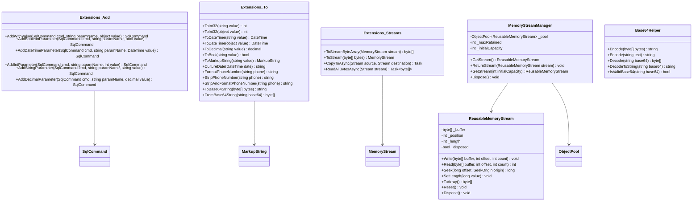

## Entity Relationships

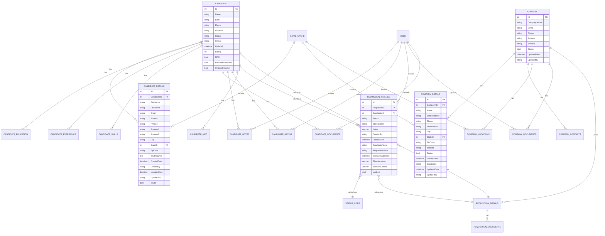

## Service Dependencies

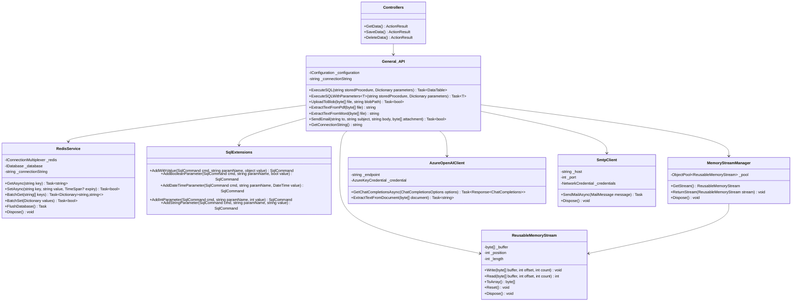

## Data Flow Diagrams

### Request Processing Flow

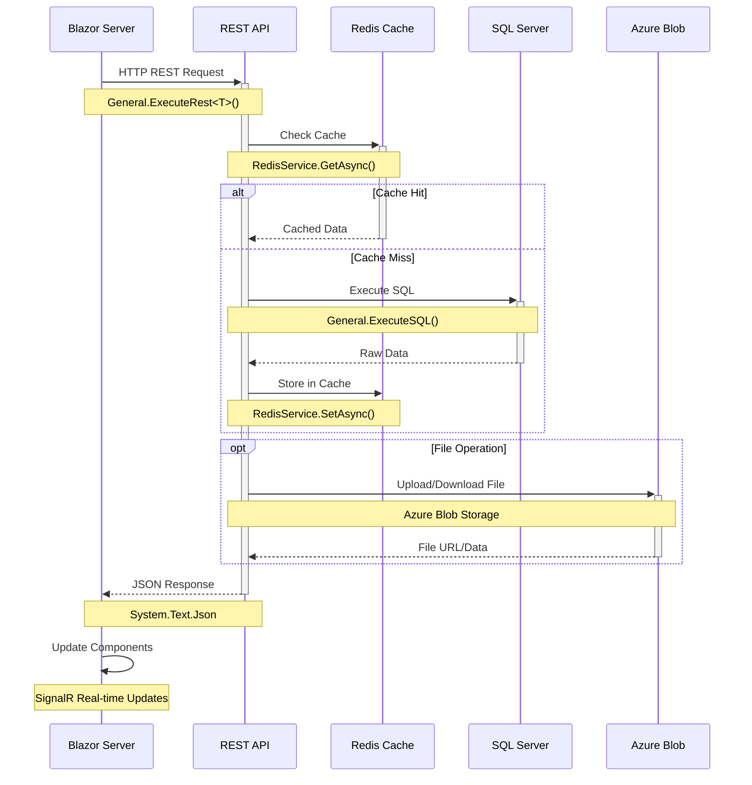

### Memory Management Flow

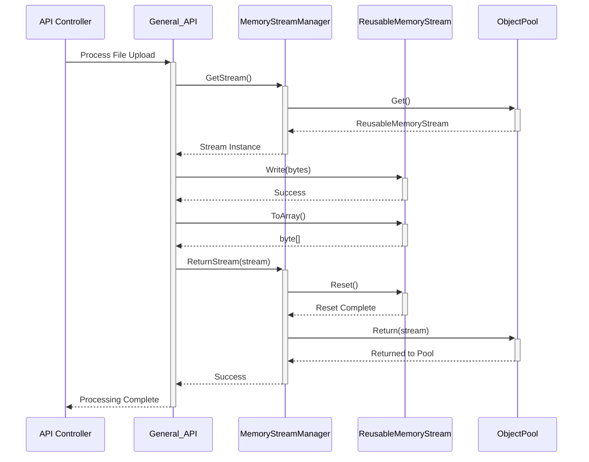

### Validation Flow

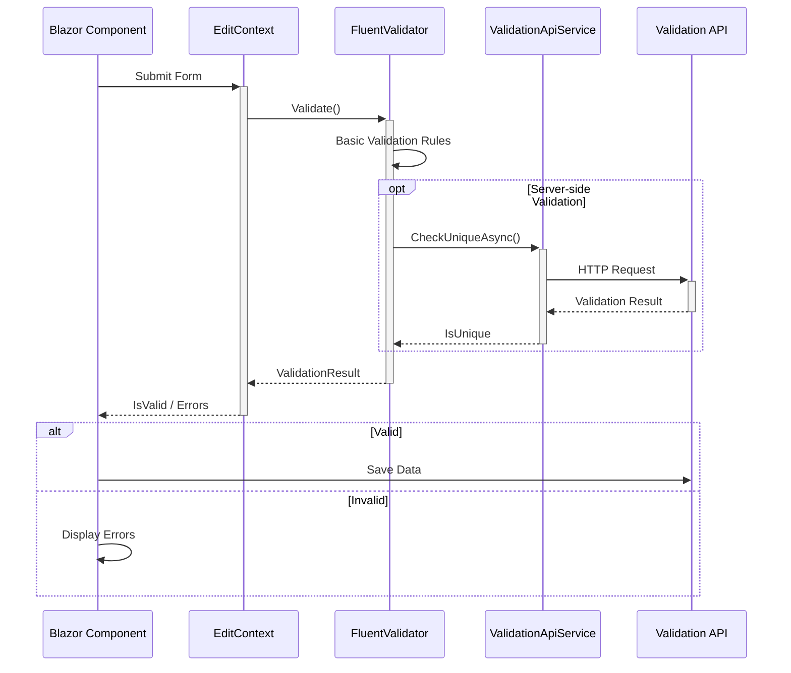

---

**Generated:** 2025-07-28  
**File Type:** Mermaid Class Diagrams  
**Total Diagrams:** 12 comprehensive diagrams  
**Coverage:** Complete solution architecture  